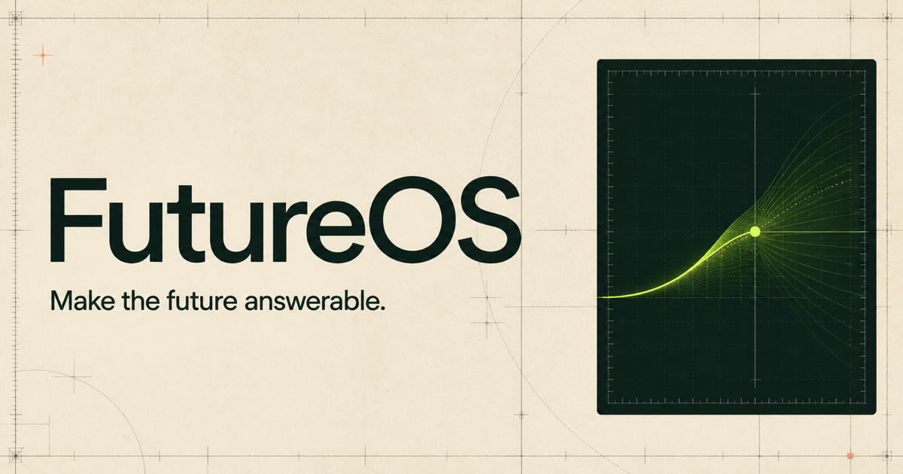

# FutureOS

**A decision operating system for people working under genuine uncertainty.**

[Live product](https://futureos.space) · [Open instruments](https://futureos.space/tools) · [Research protocol](https://futureos.space/research) · [Public impact](https://futureos.space/impact) · [Privacy](https://futureos.space/privacy)



Most software stores what happened. FutureOS preserves the decision contract that existed **before** anyone knew the answer: what you believed, why you acted, what changed, and what reality eventually proved.

## The operating loop

1. **Frame** — turn an ambiguous choice into a question reality can answer.
2. **Forecast** — expose probability, value, downside, and reversibility before acting.
3. **Update** — let new evidence change the belief without erasing its history.
4. **Resolve** — separate process quality from luck and keep the lesson reusable.

## Why it is different

FutureOS treats a decision as a versioned object rather than a note or chat transcript. Each record can retain a forecast, assumptions, evidence updates, an outcome, and a calibration signal. The goal is not to pretend uncertainty disappears; it is to make uncertainty inspectable and learning cumulative.

## Applied mathematics

- **Expected utility:** `EU(a) = Σ p(s) · u(a,s)`
- **Bayesian revision:** `P(H|E) ∝ P(E|H)P(H)`
- **Brier scoring:** `BS = mean((p − o)²)`
- **Option value:** reversibility and preserved future choices are treated as decision assets

The product presents its score weights as transparent heuristics, not universal scientific estimators. The [research protocol](https://futureos.space/research) states the hypotheses, measures, failure conditions, and current limitations. See [Mathematical foundations](docs/MATHEMATICAL_FOUNDATIONS.md) for implementation details.

## Open instruments

- **Decision Quality Score** — a seven-dimension pre-mortem for one real decision.
- **Probability Calibration Test** — ten probability judgments scored with the Brier rule.

No account is required. Answers, confidence values, and scores remain in the browser. FutureOS records only deduplicated start, completion, and voluntary share events with coarse source attribution. The complete aggregate appears on the [public impact page](https://futureos.space/impact), including zeros and limitations.

## Product surfaces

- Public editorial landing page and interactive demo
- Authenticated decision workspace
- Decision creation, evidence updates, resolution, and memory
- Decision map and aggregate insight views
- Open research protocol and public aggregate impact evidence
- Responsive layout, accessible focus states, metadata, sitemap, and security headers

## Technology

- React 19 + TypeScript
- Vinext + Vite
- Tailwind CSS
- Drizzle ORM + SQLite-compatible D1 storage
- Sites authentication (`Sign in with ChatGPT`)
- Zod validation and server-side ownership checks

## Run locally

Requires Node.js 22.13 or newer.

```bash
npm install
npm run dev
```

Quality checks:

```bash
npm run lint
npm run build
```

Authenticated and database-backed flows depend on a compatible Sites runtime. Public routes and open instruments can be reviewed locally.

## Privacy and security

Decision records are scoped to the authenticated Sites user identifier, and every read and write includes a server-side ownership check. Public-instrument answers are not transmitted or stored. The measurement endpoint records only coarse source attribution and start/completion/share events using a rotating one-way visitor key.

Read the live [privacy note](https://futureos.space/privacy) and report vulnerabilities according to [SECURITY.md](SECURITY.md). Do not submit sensitive personal decisions to a development environment.

## Status

FutureOS 1.0 is a working public product and an open research program. It does **not** yet claim that use improves judgment. Longitudinal evidence will require consented participants, repeated resolved decisions, attrition reporting, and within-person calibration analysis.

Earlier forecasting prototypes remain preserved in repository history and the existing beta tags.

## Contributing

Constructive issues and small, testable pull requests are welcome. Start with [CONTRIBUTING.md](CONTRIBUTING.md) and follow the [Code of Conduct](CODE_OF_CONDUCT.md).

## License and citation

MIT — see [LICENSE](LICENSE). Citation metadata is available in [`CITATION.cff`](CITATION.cff).
